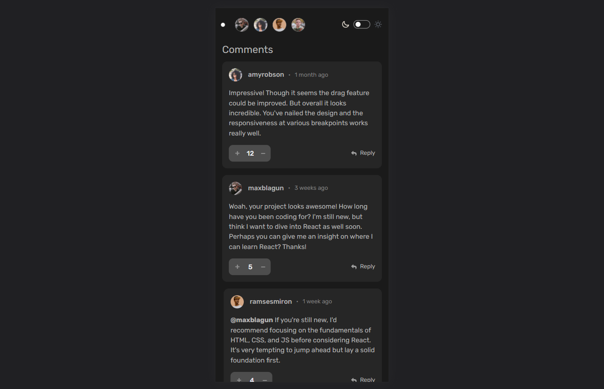
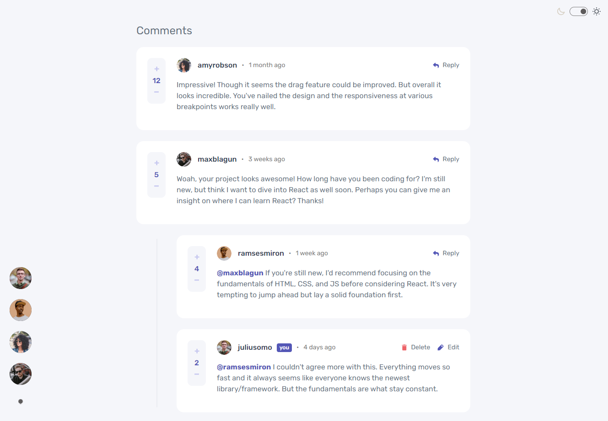
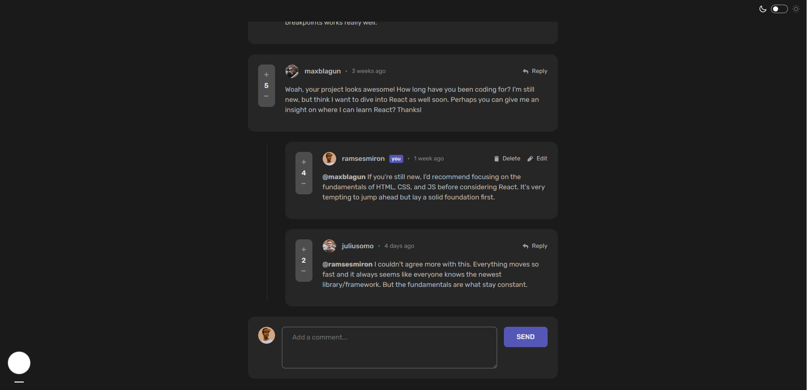
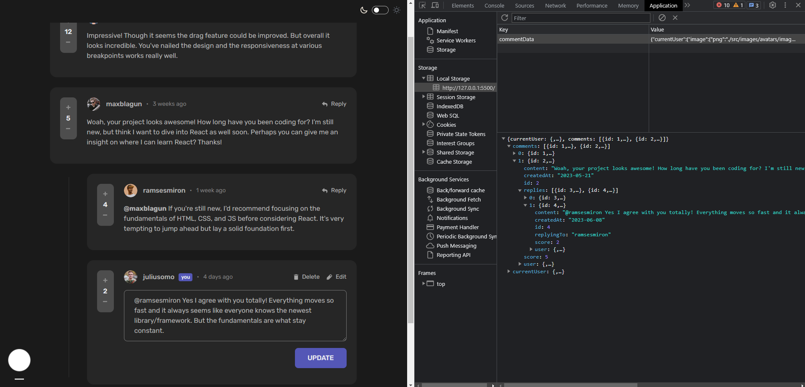

# Frontend Mentor - Interactive comments section solution

This is a solution to the [Interactive comments section challenge on Frontend Mentor](https://www.frontendmentor.io/challenges/interactive-comments-section-iG1RugEG9). Frontend Mentor challenges help you improve your coding skills by building realistic projects. 

## Table of contents

- [Overview](#overview)
  - [The challenge](#the-challenge)
  - [Screenshot](#screenshot)
  - [Links](#links)
- [My process](#my-process)
  - [Built with](#built-with)
  - [What I learned](#what-i-learned)
  - [Continued development](#continued-development)
  - [Useful resources](#useful-resources)
- [Author](#author)

## Overview

### The challenge

Users should be able to:

- View the optimal layout for the app depending on their device's screen size
- See hover states for all interactive elements on the page
- Create, Read, Update, and Delete comments and replies
- Upvote and downvote comments
- Toggle between dark and light mode
- Switch between the current user
- **Bonus**: If you're building a purely front-end project, use `localStorage` to save the current state in the browser that persists when the browser is refreshed.
- **Bonus**: Instead of using the `createdAt` strings from the `data.json` file, try using timestamps and dynamically track the time since the comment or reply was posted.

### Expected behaviour

- Replying to a comment adds the new reply to the bottom of the nested replies within that comment.
- A confirmation modal should pop up before a comment or reply is deleted.
- Adding a new comment or reply uses the `currentUser` object from within the `data.json` file.
- You can only edit or delete your own comments and replies.

### Screenshot

- 
- 
- 
- 
- 

### Links

- Solution URL: [https://github.com/Jo-cloud85/interactive-comments-section.git](https://github.com/Jo-cloud85/interactive-comments-section.git)
- Live Site URL: [https://jo-cloud85.github.io/interactive-comments-section/](https://jo-cloud85.github.io/interactive-comments-section/)

## My process

### Built with

- Semantic HTML5 markup
- CSS custom properties
- Flexbox
- CSS Grid
- Mobile-first workflow
- [Styled Components](https://styled-components.com/) - For styles

### What I learned

One of the challenges that pushed me to drill on my basic and intermediate level javascript skills.

In general, I learnt:

- How to write more modular code using functions. 
- The difference between handling objects and arrays, and their respective methods to iterate through the nested elements.
- New properties like previousElementSibling and nextElementSibling
- New methods like closest(), has(), get(), set(), splice()
- dataset values are in strings thus you need to convert them whenever necessary
- Working with localStorage to get and set values
- addEventListener using 'submit' 
- Creating pop-ups
- Using picture element for HTML to wrap around png images and other formats using srcset attribute. This helps to exercise more control over images with fixed formats.

I also had a lot of fun using template literals. Although I have been using template literals previously, I use them extensively in this challenge which made me realise how powerful they can be.

### Continued development

Building this into a full-stack CRUD application.

### Useful resources

- [JavaScript Event Types](https://data-flair.training/blogs/javascript-event-types/) - This helped me to understand more on event types, beyond mouse and keyboard events which I was more familiar with.
- [How to Use Local Storage with JavaScript](https://www.section.io/engineering-education/how-to-use-localstorage-with-javascript/) - This guy used a simple example to illustrate how localStorage works.

## Author

- Frontend Mentor - [@Jo-cloud85](https://www.frontendmentor.io/profile/Jo-cloud85)
